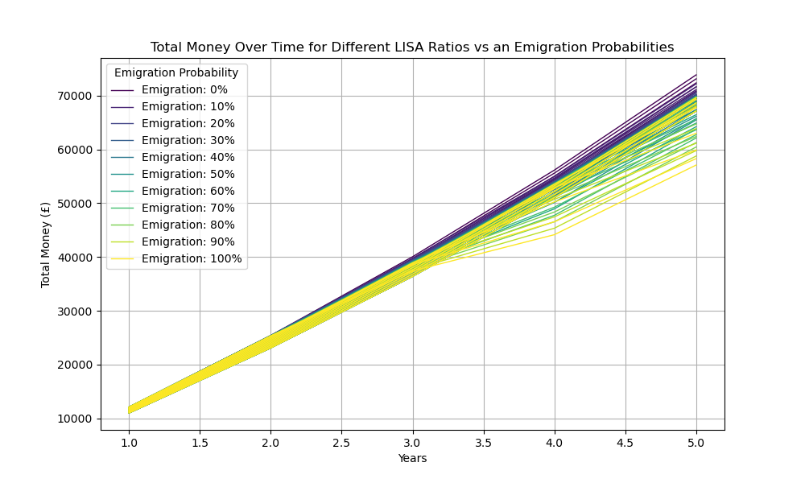

ISA & LISA Savings Growth Estimator

A personal project to estimate and visualize the returns on UK savings accounts, focusing on Individual Savings Account (ISA) and Lifetime ISAs (LISA). The tool simulates growth over time accounting for annual interest rates, contribution limits, government bonuses, and additional real-world factors such as the probability of emigrating and withdrawl penalties. 

Background & Motivation:
The purpose of this project is to come up with practical applicable results for my situation, and was desgined for that, although with some customizability. I wanted to find out what the optimal ratio to split investments into ISA and LISA accounts based on probabilty of emigrating, since the LISA account total can only be withdrawn if purchasing a home in the UK (or over 60 years of age), but if emigrating this will likely not happen, and only delay purchasing a home abroad. This is why this project is useful, as it helps to identify the best ratio of money to invest into a LISA given variable numbers we can decide on, e.g. number of years, emigration probability, interest rate, etc.

Methodology:
If it wasn't for the penalty function this would be a simple optimization problem, and we would generally expect the 25% governmental bonus to the LISA to significantly outperform investing solely in an ISA. However the penalty function is the crucial consideration as this possibility heavily penalizes funds in the LISA account, making the problem significantly more difficult to solve. The penalty for withdrawing money from the LISA account without meeting the given conditions is 25% of the total sum, and I implemented a custom penalty function to attempt to simulate this, without simply averaging 25% penalty with emigration probability. I did this with a sigmoid function, the reason for this is; we can see that if I had a minimal sum of lets say £100, and I was planning to purchase a home abroad, then this sum is virtually nothing and can be ignored without any financial OR emotional pain. We can also expect there to be some value which would require withdrawing the sum and incurring the 25% penalty in order to facilitate purchasing a home abroad, I assumed this to be £20,000. As we go over that amount significantly, we can say that the penalty is too large to withdraw the money and so the penalty function continues to increase, factoring in emotional pain + financial pain of delaying a home purchase abroad. I capped the maximal penalty function to 50%, although allowed for flexibility in many of the metrics of the function. Additionally the graph for the penalty function is still weighted based on emigration probabilty, rather then graphing seperate scenarios for emigrating and not emigrating, we average out these results.

Features & Goals:
- Estimate total savings growth over a user-defined period
- Model annual contribution limits specific to ISA and LISA
- Incorporate compound interest effects for realistic growth projections
- Account for the government LISA bonus (25% on contributions)
- Include withdrawal penalties for early LISA withdrawals (when applicable)
- Integrate a custom penalty function based on the probability of emigrating, affecting the net returns
- Provide visual insights through multiple plotting methods to understand the impact of contribution strategies and external factors

How It Works:
The estimator simulates yearly investments considering various factors:
- Each year, contributions are made up to the allowed limit.
- Interest compounds annually on the total balance.
- For LISA accounts, a 25% government bonus is added yearly on the amount contributed.
- If early withdrawals occur (e.g., due to emigration), penalties reduce the effective balance.
- A penalty function adjusts final returns based on the probability of emigrating within the savings period.

Graphs and Visualizations:
The project offers multiple plotting functions to analyze and visualize investment strategies and outcomes. For my analysis I chose values of, years=5, interest rate = 1.1 and yearly deposit = 10,000, LISA annual cap = 4,000.

Penalty Function:
The equation of the penalty function is defined as 1-P(x) where:
  x = total balance at withdrawal
  P(x) = max_value * σ((central_point - x) / scale)
  σ(z) = 1 / (1+e^(-z))

max_value = The max value the graph tends to, (0.5 by default) representing a 50% hit to the total balance.
central_point = The centre of the sigmoid graph, the x position where the graph reaches half the max_value (0.25 by default).
scale = The steepness of the ramp, useful when using the sigmoid function for very large values, like 20,000.

The following graph shows how the total 'effective' (money after being penalized) money varies across the 5 years, a max contribution to the LISA would be best performing with no penalty function applied, however in this case we are applying the penalty. For an emigration probabilty of 50%, this graph shows interestingly, that neither a 0.0 ratio nor a max ratio of 0.4 achieve the optimal results, the optimal distribution given oursetup is found to be 0.2, implying the ideal split yearly is 8,000 ISA and 2,000 LISA. This makes sense given the penalty function, since we know that with no penalty the LISA contributions are better, and this is found to be the optimal amount since we maximize the LISA bonus, whilst minimizing the penalty. The LISA account is not reaching near the centre of the penalty function, so the penalty remains low.

This graph shows the total effective money compared to the ratio split for a given emigration 0.5. This gives a relatively smooth curve, where we see the true best ratio is at 0.18 using larger precision for our ratios. It is interesting to note that the graph levels out again at the 0.29-0.3 ratio, we can find the reason for this given the penalty function. We know the function levels off, and so we can imagine that as the LISA ratio gets sufficiently high, going any higher wouldn't incur siginificantly more penalty, if we changed the lisa cap to be signifcantly higher, we may see that the ideal ratio is actually far higher.

This is the key graph for my objectives, it shows how the ideal ratio changes based on emigration chance. As we would expect, the best ratio starts off high and decreases as we the emigration chance increases. The interesting part about this graph is the shape however, we see a flat region from around 0-0.23 (emigration prob), where 0.4 ratio split is ideal throughout that whole range. At the end of that range there is a very steep drop off where the ideal ratio plummets to around 0.21, and then continues to drop as emigration chance increases. We can note that the graph appears to have 'steps' showing that a best ratio remains best for a region of emigration probabilities until dropping off suddenly.

The following graph shows blocks of ratios for a given emigration probability. We can see how the graphs become more jagged at higher probabilities, and far more smooth at lower probabilities. The lines also seperate more at higher probabilities, remaining relatively compact at higher values. As we expect, the total effective money values are higher for the lower emigration probability graphs, as the penalty function would be weighted lower.

Now we can see the average results for each of these 'blocks', this graph shows how the average value smoothly spreads out based on emigration probability.The value of the lines correspond exactly to the lower probabilities, e.g. lower emigration probability -> higher total value.

Lastly, we have a heatmap for ratio vs emigration probability. The optimal path here corresponds exactly to our previous ratio, emigration graph. The brightest yellow regions show the areas with the highest portfolio values, this graph helps to see how the total value drops off significantly if we tried to use higher LISA ratios at higher emigration probabilties.

