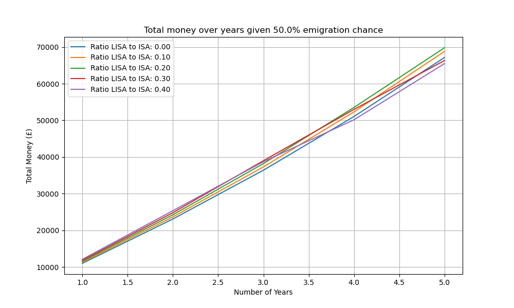
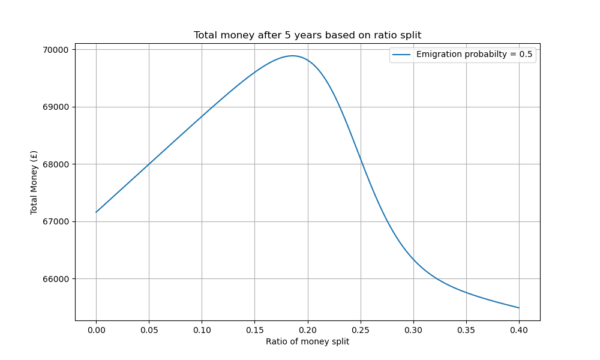
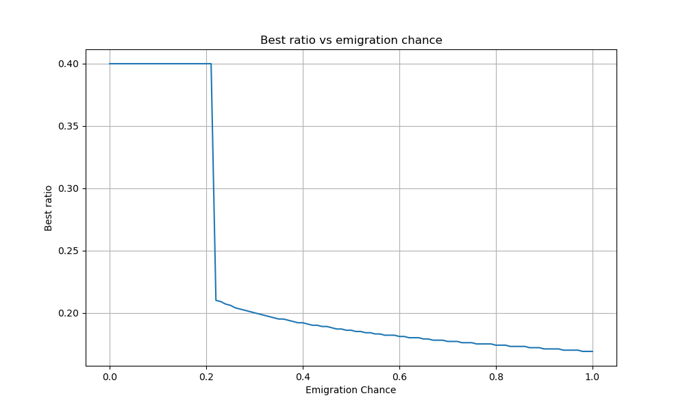

ISA & LISA Savings Growth Estimator

A personal project to estimate and visualize the returns on UK savings accounts, focusing on Individual Savings Account (ISA) and Lifetime ISAs (LISA). The tool simulates growth over time accounting for annual interest rates, contribution limits, government bonuses, and additional real-world factors such as the probability of emigrating and withdrawl penalties. 

Background & Motivation:
The purpose of this project is to come up with practical applicable results for my situation, and was desgined for that, although with some customizability. I wanted to find out what the optimal ratio to split investments into ISA and LISA accounts based on probabilty of emigrating, since the LISA account total can only be withdrawn if purchasing a home in the UK (or over 60 years of age), but if emigrating this will likely not happen, and only delay purchasing a home abroad. This is why this project is useful, as it helps to identify the best ratio of money to invest into a LISA given variable numbers we can decide on, e.g. number of years, emigration probability, interest rate, etc.

Methodology:
If it wasn't for the penalty function this would be a simple optimization problem, and we would generally expect the 25% governmental bonus to the LISA to significantly outperform investing solely in an ISA. However the penalty function is the crucial consideration as this possibility heavily penalizes funds in the LISA account, making the problem significantly more difficult to solve. The penalty for withdrawing money from the LISA account without meeting the given conditions is 25% of the total sum, and I implemented a custom penalty function to attempt to simulate this, without simply averaging 25% penalty with emigration probability. I did this with a sigmoid function, the reason for this is; we can see that if I had a minimal sum of lets say £100, and I was planning to purchase a home abroad, then this sum is virtually nothing and can be ignored without any financial OR emotional pain. We can also expect there to be some value which would require withdrawing the sum and incurring the 25% penalty in order to facilitate purchasing a home abroad, I assumed this to be £20,000. As we go over that amount significantly, we can say that the penalty is too large to withdraw the money and so the penalty function continues to increase, factoring in emotional pain + financial pain of delaying a home purchase abroad. I capped the maximal penalty function to 50%, although allowed for flexibility in many of the metrics of the function. Additionally the graph for the penalty function is still weighted based on emigration probabilty, rather then graphing seperate scenarios for emigrating and not emigrating, we average out these results.

Features & Goals:
- Estimate total savings growth over a user-defined period
- Model annual contribution limits specific to ISA and LISA
- Incorporate compound interest effects for realistic growth projections
- Account for the government LISA bonus (25% on contributions)
- Include withdrawal penalties for early LISA withdrawals (when applicable)
- Integrate a custom penalty function based on the probability of emigrating, affecting the net returns
- Provide visual insights through multiple plotting methods to understand the impact of contribution strategies and external factors

How It Works:
The estimator simulates yearly investments considering various factors:
- Each year, contributions are made up to the allowed limit.
- Interest compounds annually on the total balance.
- For LISA accounts, a 25% government bonus is added yearly on the amount contributed.
- If early withdrawals occur (e.g., due to emigration), penalties reduce the effective balance.
- A penalty function adjusts final returns based on the probability of emigrating within the savings period.

Graphs and Visualizations:
The project offers multiple plotting functions to analyze and visualize investment strategies and outcomes.

Penalty Function:

